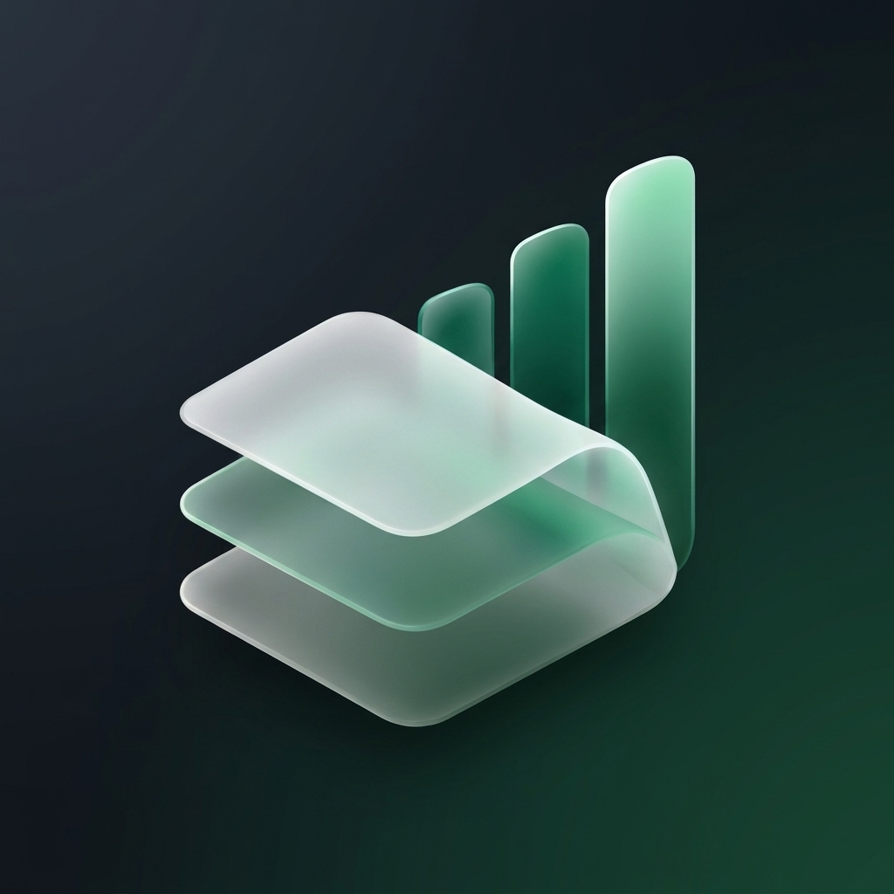
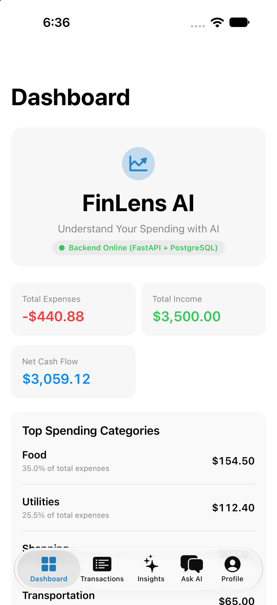
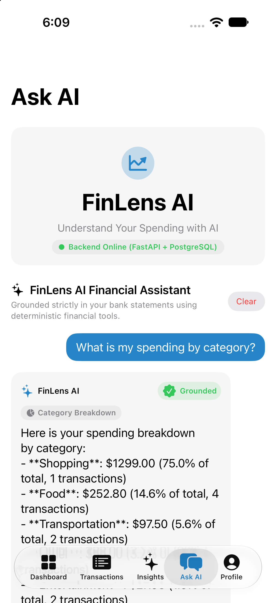
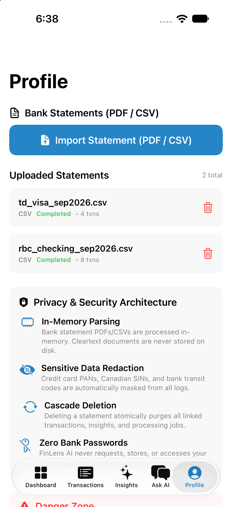
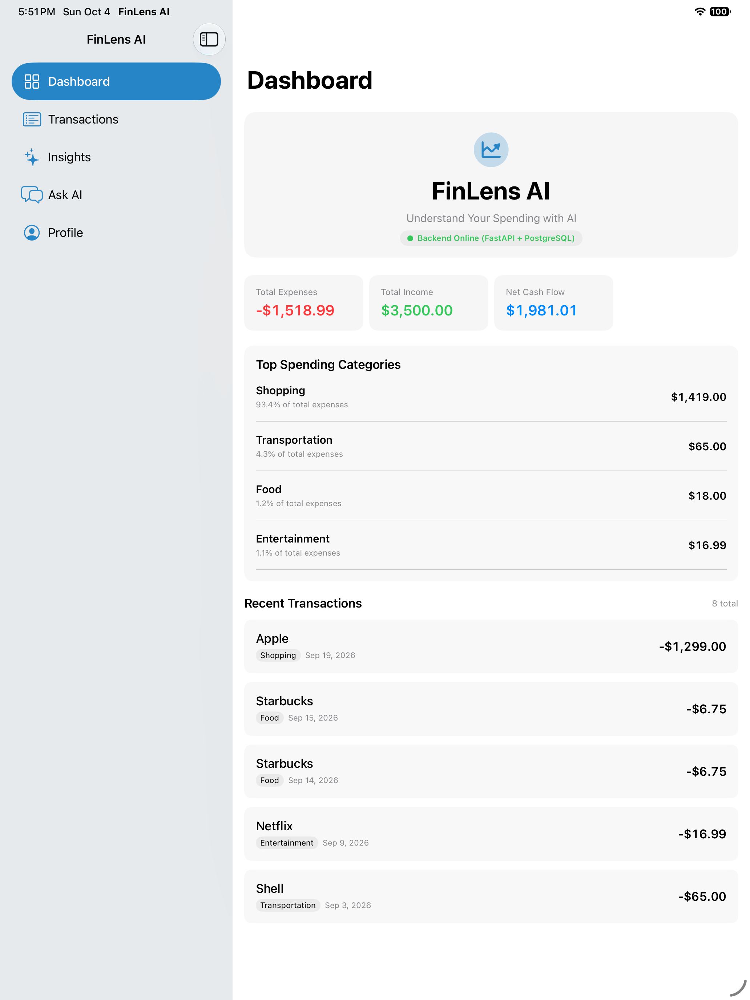
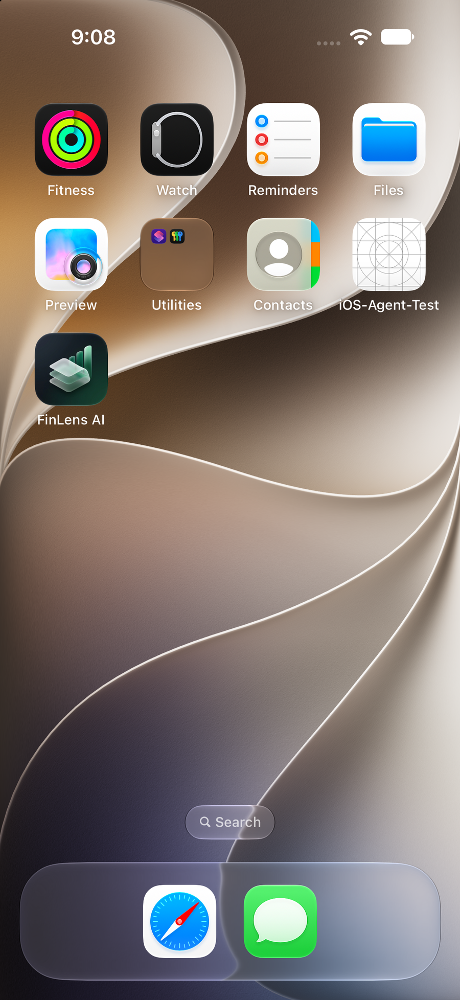
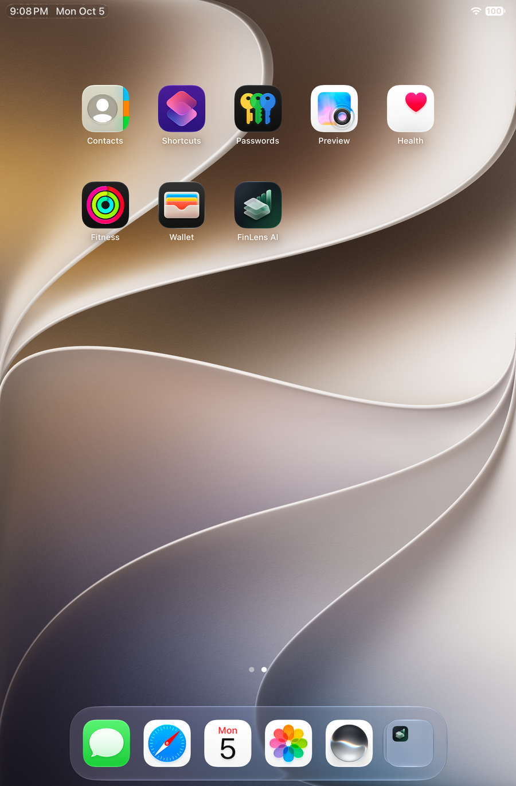

# FinLens AI

<div align="center">



# FinLens AI
### Understand Your Spending with AI
**面向 Apple 生态的生产级智能个人财务分析应用**  
*Private, Deterministic, and Multiplatform Financial Intelligence for iOS, iPadOS & macOS*

[English](README.md) | **简体中文**

[](https://developer.apple.com/swift/)
[](https://swift.org)
[](https://fastapi.tiangolo.com)
[](https://www.postgresql.org)
[](LICENSE)

</div>

---

## 📖 项目简介 (Introduction)

**FinLens AI** 是一款专为 Apple 生态打造的智能个人财务透镜应用。它能够导入银行流水对账单（PDF / CSV），通过服务端 Document AI 管道将原本非结构化、混乱的交易记录清洗、去重、标准化，并提供**高确定性精确财务统计、多维消费洞察以及严格基于真实数据接地的 AI 财务智能助手**。

---

## 🎨 应用图标设计规范 (App Icon Design)

为告别千篇一律的“AI 蓝紫色霓虹渐变”，FinLens AI 的图标遵循苹果官方 **Human Interface Guidelines (HIG)** 顶级设计规范定制：

<table>
  <thead>
    <tr>
      <th width="50%" align="center"><b>iOS & iPadOS 移动端官方图标</b></th>
      <th width="50%" align="center"><b>macOS 桌面端专属图标</b></th>
    </tr>
  </thead>
  <tbody>
    <tr>
      <td align="center">
        <a href="docs/images/app_icon_ios.png"></a><br />
        <b>翡翠绿与黑曜石（Emerald & Obsidian）</b><br />
        <sub>1024 × 1024 Full-Bleed 纯正方形画布</sub>
      </td>
      <td align="center">
        <a href="docs/images/app_icon_macos.png"></a><br />
        <b>深蓝宝石与钛合金（Sapphire & Titanium）</b><br />
        <sub>1024 × 1024 桌面级拟物触感深度</sub>
      </td>
    </tr>
    <tr>
      <td align="left" valign="top">
        <ul>
          <li><b>隐喻设计：</b>三层等轴侧半透明磨砂玻璃账单（象征结构化收支流水），平滑向上延伸为三根圆角柱状增长图表（象征财务增长与洞察）。</li>
          <li><b>色彩调优：</b>摒弃刻板的蓝紫渐变，选用高贵稳健的<b>金融翡翠绿、薄荷绿与黑曜石深邃背景</b>，凸显克制、专业与信任感。</li>
          <li><b>规范适配：</b>严禁预切圆角，采用 1024×1024 纯方形画布与 20% 安全边距，由 iOS/iPadOS 系统自动渲染连续曲率超椭圆（Squircle）。</li>
        </ul>
      </td>
      <td align="left" valign="top">
        <ul>
          <li><b>隐喻设计：</b>桌面级专业光学财务透镜徽标，多层磨砂玻璃透镜与精密微斜倒角金属环结合。</li>
          <li><b>材质质感：</b>真实摄影棚漫反射顶光、高折射光学玻璃与钛金属纹理，完美融合 macOS 桌面端沉浸质感。</li>
          <li><b>原生切图：</b>生成覆盖 16×16 到 1024×1024 的 10 组完整原生分辨率切图与 <code>AppIcon-macOS.icns</code>。</li>
        </ul>
      </td>
    </tr>
  </tbody>
</table>

---

## 📱 多端设备视图展示与说明 (Device Views & Showcase)

FinLens AI 贯彻 **“一套架构、共享核心，因地制宜的原生 Apple 交互”** 原则，针对 iPhone、iPad 和 Mac 各自的设备形态量身打造专属体验。

### 1. iPhone 移动端核心视图 (iOS Experience)

移动端强调单手易操作性、清晰的信息层级与随手快捷的智能问答。

<table>
  <thead>
    <tr>
      <th width="33%" align="center"><b>📊 财务看板 (Dashboard)</b></th>
      <th width="33%" align="center"><b>🤖 确定性 AI 助手 (Ask AI)</b></th>
      <th width="33%" align="center"><b>🔒 账单与隐私架构 (Profile)</b></th>
    </tr>
  </thead>
  <tbody>
    <tr>
      <td align="center">
        <a href="docs/images/view_ios_dashboard.png"></a>
      </td>
      <td align="center">
        <a href="docs/images/view_ios_ask_ai.png"></a>
      </td>
      <td align="center">
        <a href="docs/images/view_ios_statements.png"></a>
      </td>
    </tr>
    <tr>
      <td align="left" valign="top">
        <b>【收支总览与分类洞察】</b><br />
        首屏卡片直观呈现总支出、总收入与净现金流（严格采用高精度 Decimal 计算，非浮点数）；分类消费排行榜以百分比及金额动态展示开销重心；支持下拉平滑刷新。
      </td>
      <td align="left" valign="top">
        <b>【数据接地智能问答】</b><br />
        集成严谨的财务问答 Agent。AI 不直接瞎编数字，而是自主调用确定性分析工具（如 <code>get_spending_by_category</code>），回答打上 <code>Grounded</code> 认证标签并附带可核验来源。
      </td>
      <td align="left" valign="top">
        <b>【安全与银行对账单管理】</b><br />
        支持随时上传/移除 PDF 及 CSV 银行流水；界面公开承诺隐私架构：内存中处理账单、脱敏银行卡号/SIN等敏感信息、支持一键级联销毁，绝不索要网银密码。
      </td>
    </tr>
  </tbody>
</table>

---

### 2. iPadOS 平板大屏生产力分栏视图 (iPadOS Experience)

针对 iPad 的大屏优势，放弃简单的拉伸界面，采用原生双栏与三栏 `NavigationSplitView` 布局。

<table>
  <thead>
    <tr>
      <th width="65%" align="center"><b>💻 iPadOS 分栏布局 (NavigationSplitView)</b></th>
      <th width="35%" align="center"><b>📱 系统主屏幕效果 (Home Screen)</b></th>
    </tr>
  </thead>
  <tbody>
    <tr>
      <td align="center">
        <a href="docs/images/view_ipad_dashboard.png"></a>
      </td>
      <td align="center">
        <a href="docs/images/view_ios_homescreen.png"></a>
      </td>
    </tr>
    <tr>
      <td align="left" valign="top">
        <b>【iPad 宽屏信息密度充分释放】</b><br />
        左侧自适应侧边栏常驻导航栏目，右侧主舞台同时容纳核心收支总览卡片、Top 消费类目排行榜以及详细的最近流水条目列表。用户在单屏内即可一目了然完成财务审计与对账。
      </td>
      <td align="left" valign="top">
        <b>【iOS / iPadOS 主屏幕图标呈现】</b><br />
        实机模拟器效果验证。由系统 SpringBoard 自动裁切出连续曲率超椭圆圆角，边缘留白适中，在浅色与深色壁纸下均具备极高的辨识度。
      </td>
    </tr>
  </tbody>
</table>

---

### 3. macOS 桌面端专属体验 (macOS Desktop Experience)

macOS 端注重桌面级键盘效率与专业工具质感，充分利用程序坞与菜单栏。

<table>
  <thead>
    <tr>
      <th width="50%" align="center"><b>🖥️ macOS 程序坞 (Dock) 专属呈现</b></th>
      <th width="50%" align="center"><b>📱 iPad mini (A17 Pro) 桌面与 Dock 栏</b></th>
    </tr>
  </thead>
  <tbody>
    <tr>
      <td align="center">
        <a href="docs/images/view_macos_dock.png"></a>
      </td>
      <td align="center">
        <a href="docs/images/view_ipad_homescreen.png"></a>
      </td>
    </tr>
    <tr>
      <td align="left" valign="top">
        <b>【程序坞拟物玻璃质感】</b><br />
        macOS Dock 栏实拍验证。专为 macOS 编译生成的 <code>AppIcon-macOS.icns</code> 拥有细腻的漫反射高光与微斜倒角，与其他专业级 macOS 生产力工具并列时兼具美感与识别度。
      </td>
      <td align="left" valign="top">
        <b>【平板全生态规格覆盖】</b><br />
        提供从 <code>76pt @2x</code> 到 <code>83.5pt @2x</code> 的全套离散规格。在 iPad mini 桌面网格及屏幕底部的常驻 Dock 栏中，图标清晰锐利无虚焦。
      </td>
    </tr>
  </tbody>
</table>

---

## 🏛️ 核心架构与设计原则 (Architectural Principles)

1. **确定性优先（Deterministic Calculations First）**：
   - 大模型（LLM）**绝不是权威的计算器**。
   - 所有账单收支、结余、分类小计、净现金流、同期对比等数据均由 Python / Swift 服务端的确定性金融算法与 Decimal 高精度引擎计算。
   - LLM 仅负责意图理解、数据总结与自然语言沟通。
2. **Apple 全平台共享核心（Shared Multiplatform Core）**：
   - 核心领域模型、网络交互客户端、ViewModel 状态（`@Observable`）统一在 `FinLensCore`（Swift Package）中维护。
   - iOS、iPadOS 与 macOS 共享 90% 以上业务逻辑代码，UI 表现层根据平台习惯自适应。
3. **零网银凭证风险（No Financial Credentials Required）**：
   - 用户仅需上传自己的离线账单（PDF / CSV），软件绝不索要、不收集、不存储任何网银账号、登录密码或两步验证（MFA）密钥。
4. **工具接地与可溯源智能（Agentic Tooling & Grounded Answers）**：
   - AI 助手配备结构化只读金融工具（`search_transactions`, `get_spending_by_category` 等），回答中包含的数据强制验证溯源依据，防止数字幻觉。

---

## 🛠️ 技术栈 (Tech Stack)

| 层次 | 核心技术 / 框架 | 关键说明 |
| :--- | :--- | :--- |
| **Apple 客户端** | Swift 6, SwiftUI, SwiftData, Observation | iOS 17+, iPadOS 17+, macOS 14+ 原生全平台架构 |
| **共享核心库** | Swift Package Manager (`FinLensCore`) | 纯平台无关业务模型、ViewModel 与 API Client |
| **后端服务** | Python 3.12, FastAPI, Uvicorn, Pydantic v2 | 异步高并发 RESTful API，严格数据模型验证 |
| **数据持久化** | PostgreSQL 16, SQLAlchemy 2.0 (asyncpg), Alembic | 结构化财务交易存储，完整 ACID 事务保障 |
| **账单文档处理** | pdfplumber, pypdf, python-dateutil | 鲁棒提取 PDF / CSV 对账单，智能商户名规范化与去重 |
| **工程构建管理** | XcodeGen, Docker, Docker Compose, uv | 自动化 Xcode 项目生成与容器化微服务编排 |

---

## 📂 项目结构 (Repository Structure)

```
FinLensAI/
├── apple/                              # Apple 多平台工程目录
│   ├── FinLens/                        # 原生应用壳（iOS, iPadOS, macOS）
│   │   ├── Sources/                    # 平台自适应 View 表现层
│   │   ├── Resources/Assets.xcassets/  # 全平台 AppIcon 与资产目录
│   │   └── project.yml                 # XcodeGen 工程配置文件
│   └── FinLensCore/                    # 共享 Swift Package (Models, ViewModels, Services)
├── backend/                            # Python FastAPI 后端服务
│   ├── app/                            # 业务路由、Agent 编排、确定性分析引擎
│   ├── tests/                          # 完整单元测试与集成测试套件
│   └── pyproject.toml                  # Python 依赖规范
├── infrastructure/                     # 基础设施配置
│   ├── docker-compose.yml              # 容器化部署
│   └── ci/ci.yml                       # GitHub Actions CI/CD 流水线
├── docs/                               # 项目文档与截图资产
│   └── images/                         # README 及官方文档展示截图
├── scripts/                            # 自动化脚本 (图标生成、发布打包、测试运行)
│   ├── deploy_app_icons.py             # 资产目录图标自动分发工具
│   └── package_apple.sh                # Apple 应用发布与打包脚本
└── README.md                           # 项目说明文档
```

---

## 🚀 快速上手 (Quick Start)

### 1. 运行后端服务与数据库

确保本地已安装 Docker 或 Python 3.12+：

```bash
# 启动 PostgreSQL 数据库容器
docker run -d --name finlens-postgres -p 5432:5432 \
  -e POSTGRES_USER=finlens_user \
  -e POSTGRES_PASSWORD=finlens_password \
  -e POSTGRES_DB=finlens_db \
  postgres:16-alpine

# 安装后端依赖并启动 FastAPI
cd backend
python3 -m venv .venv
source .venv/bin/activate
pip install -e .
uvicorn app.main:app --host 127.0.0.1 --port 8000 --reload
```

后端服务启动后，可在浏览器访问：
- API 交互式文档：`http://127.0.0.1:8000/docs`
- 健康检查：`http://127.0.0.1:8000/api/health`

### 2. 构建与运行 Apple 原生客户端

```bash
cd apple/FinLens

# 使用 XcodeGen 生成最新的 Xcode 工程
xcodegen generate

# 使用 Xcode 打开项目
open FinLens.xcodeproj
```

在 Xcode 顶部选择想要调试的目标设备（**Mac (My Mac)**、**iPhone 18 Pro** 或 **iPad Pro**），点击 **Run (⌘R)** 即可启动体验！

---

## 📜 许可证 (License)

Copyright © 2026 FinLens AI Team. All rights reserved.
